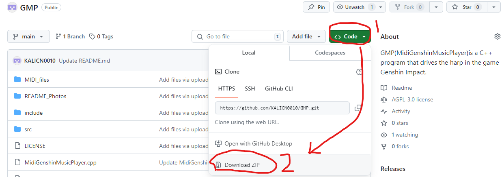
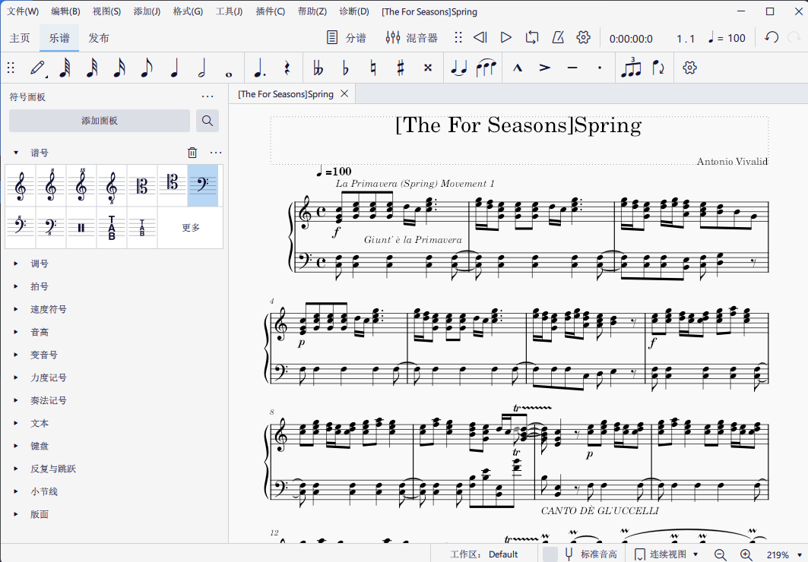

# MidiGenshinMusicPlayer

## Download Method

# MidiGenshinMusicPlayer on Gitee:
## [Click to Download MidiGenshinMusicPlayer.exe from Gitee](https://gitee.com/xr_jesse/midi-genshin-music-player/releases/download/1.0/MidiGenshinMusicPlayer.exe)

## [Click to Download Some Music I've Adapted](https://gitee.com/xr_jesse/muse-score-files/repository/archive/master.zip)

# Operation Guide

## Key Operation List

> ### Playback Status
> > #### Press F8 to toggle between Pause and Play

> ### Switch Sheet Music
> > #### Press F7 to play the previous sheet music.
> > #### Press F9 to play the next sheet music.

> ### Playback Mode
> > #### Press F10 to switch playback mode:
> > #### Single Play: Stops after each playthrough.
> > #### Loop Song: Loops the current sheet music.
> > #### Loop Directory: Loops all sheet music in the folder.

> ### Display Settings
> > #### Press the [ ↑ ] up arrow key to increase the number of displayed sheet music.
> > #### Press the [ ↓ ] down arrow key to decrease the number of displayed sheet music.
> > #### Press the [ ← ] left arrow key to decrease the number of currently displayed sheet music list.
> > #### Press the [ → ] right arrow key to increase the number of currently displayed sheet music list.

## Command Line Interface
> > #### Interface Display
> > #### After launching the program, it will display the current sheet music folder path, the current sheet music name, playback status (play/pause), and the currently displayed sheet music list.
> > #### When the playback status changes, the interface will update the display status.

## How to Operate
> ### Preparations Before Playing:
> > #### 1. Right-click MidiGenshinMusicPlayer.exe
> > #### 2. Run MidiGenshinMusicPlayer.exe as Administrator.
> > #### 3. After starting the program, press F6 to select the folder containing MIDI files; once selected, the program will list all MIDI files in the folder for you to choose from for automatic playback; by default, the first .mid file will be marked with “[]” as the “current sheet music.”
> ### To Start Playback:
> > #### 4. Select a MIDI file using F7 or F9
> > #### 5. Click on the Genshin Impact window to ensure that Windows' active window is the Genshin Impact game window.
> > #### 6. In Genshin Impact, use the musical instrument you wish to play the sheet music with: “Barbatos's Lyre,” “Old Lyre,” “Flower Reflection Lyre,” “Evening Wind Horn,” etc.
> > #### 7. Press F8 to start playing the current sheet music.
> > #### //During playback, you can toggle pause or play again by pressing F8.
> > #### //[Single Play] Mode stops after playing. Press F8 twice to re-enter play state (this bug is awaiting a fix).
> > #### //[Single Play] Mode ends in a paused state after playback.

# Important Notes
> #### 1. **If antivirus software flags the program, add it to trusted items. The presence of Windows API calls in the code can cause false positives.**
> #### 2. **The folder path containing .mid files and the file names themselves must not contain Chinese characters, otherwise it may cause garbled text display and program crashes (when attempting to play a garbled file name .mid file or when any .mid file is played in a path containing Chinese).**
> #### 3. **The program needs to be run with administrator privileges to correctly capture keyboard events.**
> #### 4. **Keep Genshin Impact running in the foreground during playback to properly simulate instrument playing actions.**
> #### 5. The released version may not be compatible with all versions of Windows (currently available for Win10 and Win11 only).
> #### 6. If the released version does not run, download the source code and compile locally using Visual Studio 2022.
> #### 6.1 Compilation settings are as shown below:
> 
> ##### Modify the Additional Include Directories path to point to the actual location of the include folder.
> 
> #### 6.2 The project file structure is shown below:
> 

# Recommended Sheet Music Editing Tools
> ## Internationally renowned open-source music notation software Muse Score Studio:
> ## [Click to Download Muse Score Studio](https://musescore.org)

> ## //In MuseScore, you can open .mscz files and export them as .mid files, which can then be played in MidiGenshinMusicPlayer (.mscz files are the proprietary sheet music format for MuseScore).
> 
> ## Notes for Editing Sheet Music
> > ### 1. It's best to adjust downloaded Midi files to C major in MuseScore (because non-C major may contain semitones and exceed the range, causing them to be unrecognizable and unplayable).
> > 
> > 
> > 
> > ### 2. Then make appropriate adjustments; sharp and flat notes and those exceeding the 21 notes of the Genshin lyre will be ignored.
> > 
## Some Tips for Using MuseScore
> #### 1. You can open .mid files and automatically convert them to .mscz files, then export the edited file as .mid or another format (meaning you can edit .mid files downloaded from other platforms) (note: overly complex .mid files may cause MuseScore to freeze, such as .mid files generated from waveform recognition software for vocal songs, which often contain excessively complex note information).

# MuseScore Sheet Music Website:
> ## [Click to Visit MuseScore.com](https://musescore.com)

## Shortcut for Converting Sheet Music PDF to MSCZ File on MuseScore:
> ## [Click to Convert Sheet Music PDF to MSCZ on MuseScore.com](https://musescore.com/import?from=upload)

# How to Find Free Downloadable Sheet Music on MuseScore:
> #### 1. Search for the sheet music title in the top search bar.
> #### 2. Scroll down the page and check [Free to view, play & download].
> #### 3. View and download the sheet music.
> 
> ### //Note:
> #### Regular users can download and print up to 20 sheet music files per day. After reaching the daily limit, downloads will be unavailable.
> #### If you determine that the sheet music's pitch range doesn't overflow and there are no sharps or flats (i.e., the software can play it directly), you can choose to download the MIDI (.mid) format without downloading the .mscz format.
> 
