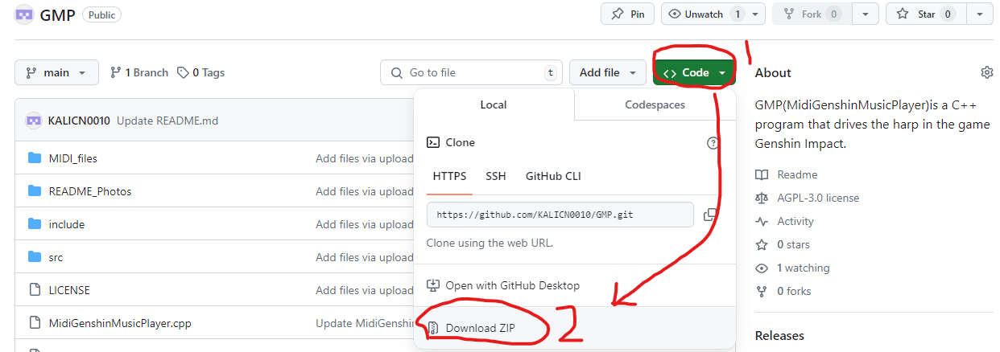
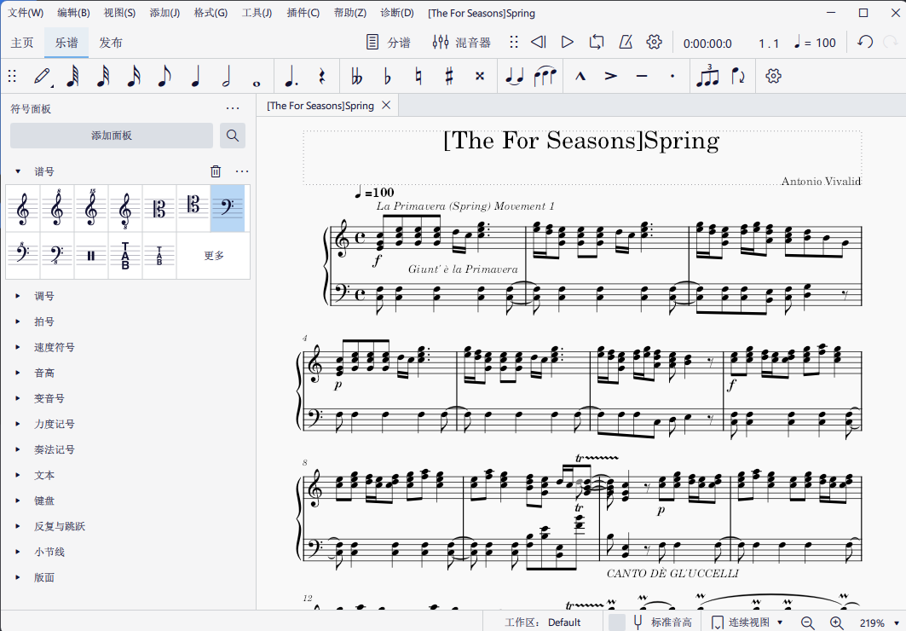
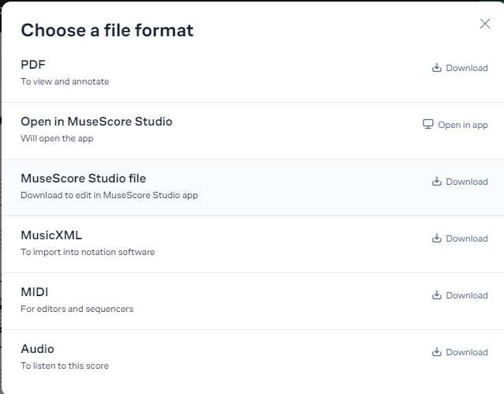

# MidiGenshinMusicPlayer

## 下载方法

# MidiGenshinMusicPlayer On Gitee：
## [点击前往Gitee下载 MidiGenshinMusicPlayer.exe](https://gitee.com/xr_jesse/midi-genshin-music-player/releases/download/1.0/MidiGenshinMusicPlayer.exe)

## [点击前往Gitee下载我改编过的一些音乐](https://gitee.com/xr_jesse/muse-score-files/repository/archive/master.zip)

# 操作指南

## 按键操作列表

> ### 播放状态
> > #### 按 F8 切换 暂停 或 播放

> ### 切换乐谱
> > #### 按 F7 键播放上一个乐谱。
> > #### 按 F9 键播放下一个乐谱。

> ### 播放模式
> > #### 按 F10 键切换播放模式：
> > #### 单次播放：每次播放完毕后停止。
> > #### 单曲循环：当前乐谱循环播放。
> > #### 目录循环：循环播放整个文件夹中的所有乐谱。

> ### 显示设置
> > #### 按 [ ↑ ] up键 (向上箭头键) 增加乐谱显示数量。
> > #### 按 [ ↓ ] down键 (向下箭头键) 减少乐谱显示数量。
> > #### 按 [ ← ] left键 (向左箭头键) 减少当前显示的乐谱列表数量。
> > #### 按 [ → ] right键 (向右箭头键) 增加当前显示的乐谱列表数量。

## 命令行界面
> > #### 界面显示
> > #### 程序启动后会显示当前的乐谱文件夹路径、当前乐谱名称、播放状态（播放/暂停）以及当前显示的乐谱列表。
> > #### 当播放状态改变时，界面会更新显示状态。

## 操作方法
> ### 演奏前的准备操作：
> > #### 1.右键程序 MidiGenshinMusicPlayer.exe
> > #### 2.以“管理员身份运行”MidiGenshinMusicPlayer.exe。
> > #### 3.启动程序后，按 F6 键来选择包含MIDI文件的文件夹；选择完成后，程序会列出文件夹中的所有MIDI文件供您选择自动演奏；默认第一个.mid文件会被“[]”标记为“当前乐谱”。
> ### 开始播放的操作：
> > #### 4.用 F7 或 F9 选择好一个MIDI文件
> > #### 5.点击《原神》的窗口，使Windows系统的窗口焦点在《原神》的游戏窗口上
> > #### 6.在《原神》中使用你想用于演奏该乐谱的音乐道具：“风物之诗琴”、“老旧的诗琴”、“镜花之琴”、“晚风圆号”等
> > #### 7.按 F8 键开始演奏当前乐谱。
> > #### //在播放过程中，可以通过按 F8 键再次切换暂停或播放的状态。
> > #### //[单次播放]模式停止播放后，需两次按下F8以重新进入播放状态(该bug等待修复中
> > #### //[单次播放]模式下播放结束后，程序默认进入暂停状态。

# 注意事项
> #### 1.  _**杀毒软件报毒的话添加信任就行，因为代码中有WindowsAPI的调用，报毒是正常的**_ 
> #### 2.  _**.mid文件所在的文件路径以及.mid文件的文件名不得包含中文，否则会导致显示乱码以及程序崩溃(发生在试图播放 文件名乱码 的.mid文件时 以及 文件路径 中 包含中文 时播放任意.mid文件)**_ 
> #### 3.  _**程序需要以管理员权限运行，以便正确捕获键盘事件。**_ 
> #### 4.  _**在播放过程中，保持《原神》游戏处于前台运行状态，以便正确模拟乐器演奏动作。**_ 
> #### 5. releases发行的版本不是所有Windows版本可用（目前仅Win10和Win11可用）
> #### 6. 如果releases发行的版本无法运行请下源代码载到本地用Visual Studio2022编译
> #### 6.1 编译时的设置如下图所示
> 
> ##### 附加包含目录 指向的 include文件夹 的路径请根据该文件夹的实际位置自行修改
> 
> #### 6.2 项目的文件结构如下图所示
> 

# 乐谱编辑工具推荐
> ## 国际知名专业开源五线谱编辑软件 Muse Score Studio：
> ## [点击前往下载 Muse Score Studio](https://musescore.org)
> 
> ## //在MuseScore中可以打开.mscz文件并导出为.mid文件,然后就可以在MidiGenshinMusicPlayer中演奏（.mscz文件是MuseScore的特有五线谱格式）
> 
> ## 修改乐谱注意事项
> > ### 1.自己下载的Midi文件最好先用MuseScore改为C大调（因为不是C大调的话可能五线谱表示的有些音符可能是半音，甚至超出音域，从而导致无法识别并演奏）
> > 
> > 
> > 
> > ### 2.然后适当修改，如果有升降调的音符和超出原神琴的21个音的音符会被忽略
> > 
## MuseScore的一些使用技巧
> #### 1. 可以打开.mid文件并自动转换为.mscz文件，然后您可以再导出编辑好的文件为.mid或者其他格式（意味着您可以编辑您在其他平台下载的.mid文件）（注意，过于复杂的.mid文件可能导致MuseScore无响应,比如人声歌曲经过波形识别软件生成的.mid文件，往往这种用于整活的.mid文件包含过于复杂的音符信息）

# MuseScore的五线谱音乐站：
> ## [点击前往 MuseScore.com](https://musescore.com)
> 
> ## MuseScore的五线谱PDF转MSCZ文件功能的快捷方式：
> ## [点击前往 MuseScore.com 转换五线谱PDF为MSCZ五线谱](https://musescore.com/import?from=upload)

# 怎么在MuseScore中找到可以免费下载的五线谱如下图所示：
> #### 1.在顶部的搜索框内搜索你想要的五线谱的名称
> #### 2.向下拉动页面，勾选 [Free to view, play & download]
> #### 3.查看并下载五线谱
>
> ### //注意：
> #### 普通用户每天只可以下载和打印20份五线谱，当天下载满20份五线谱后将无法下载
> #### 如果在MuseScore网站上确定了您正要下载的五线谱音域没有溢出，且没有升降调（即本软件可以直接正常播放），那可以选择下载MIDI（.mid）格式，而无需下载.mscz格式
> #### 
